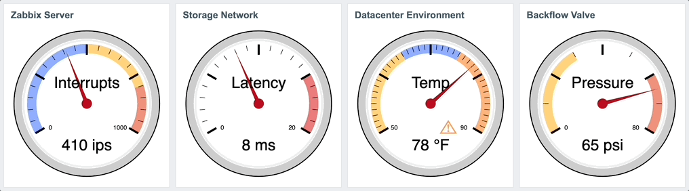
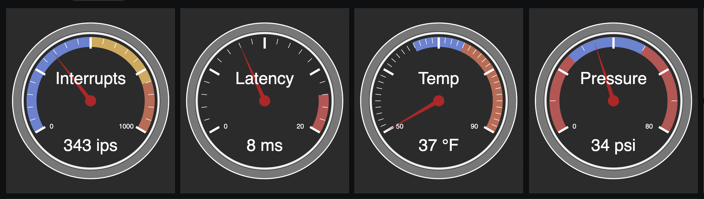

# Zabbix-Dashboard-Gauge
Add a Gauge Widget to your Zabbix Dashboards.

## What's new
##### May 3, 2022
* RELEASE: Patch now available for Zabbix 6.0.4
* RELEASE: Patch now available for Zabbix 5.4.12
* RELEASE: Backport now available for Zabbix 5.0.22 - 5.0.23
* ENHANCEMENT: Optional indicator light with strobe support for Zabbix 6.0.3 and later
* FIX: Refactor edit widget layout
* FIX: Eliminate old pre-release code that supported google chart
* FIX: Partial fix for broken min/max logic

##### April 6, 2022
* FIX: Updated patch 6.0.3 for better CSS support in Firefox
* FIX: Updated patch 6.0.3 to support shaded region drawing logic for Firefox and Mozilla
* BUG: Broken min/max error checking on shaded regions

##### April 5, 2022
* RELEASE: Patch now available for Zabbix 6.0.3

##### March 29, 2022
* FIX: Widget header now functional ([CJVisser](http://github.com/CJVisser/))

##### March 15, 2022
* RELEASE: Patch now available for Zabbix 6.0.2
* FIX: Defined boundary arcs for shaded areas to not exceed min or max
* FIX: Needle movement restricted inside min and max
* ENHANCEMENT: Some dark mode updates

##### March 14, 2022
* ENHANCEMENT: Patch now available for Zabbix 5.4.11
* ENHANCEMENT: Now with dark mode!
* ENHANCEMENT: Changed padding value, gauge is a little larger
* FIX: Performance issue with API query resolved

##### March 13, 2022
* Initial Public Beta Release

## About the Gauge

The design of the Zabbix Gauge Widget is strongly influenced by [Google Chart's 'Gauge'](https://developers.google.com/chart/interactive/docs/gallery/gauge). It tries to emulate most of the configurable features of the google release and uses native Zabbix function calls to express svg without third-party javascript. Because it's a native widget, it can be added, resized, and moved around just like any other widget on your dashboard.

Configuration of the gauge supports naming the widget, labeling the gauge, selecting your item, the gauge range, displaying the number of 'minor ticks' between 'major ticks', and defining up to three shaded regions to show normal and problem value ranges, and an optional indicator light (6.0.3 and later).  The gauge also displays the value with units.

## What's inside
The installer script and related patches add functionality to zabbix-web to display item values in a gauge-style widget. _gauge-installer_ is an interactive script, it will confirm your zabbix docroot, zabbix release, backup your docroot into a tar file, and attempt a dry-run of the install before asking you if you are sure you really really want to install it.  There is also an option to reverse the install in case you change your mind.  See the section "Working with Patches" for more info. 

## Prerequisites
* Zabbix 5.0.22 - 5.0.23, 5.4.11 - 5.4.12, 6.0.1 - 6.0.4
* Linux binaries: _patch, grep, tar, cut, date, bash, git_

## Install
1. ```cd /root ; git clone https://github.com/jack-valko/Zabbix-Dashboard-Gauge.git```
2. ```cd Zabbix-Dashboard-Gauge ; ./gauge-installer```
3. Browser-refresh your dashboard pages  

## Why Isn't This a Frontend Module?
Good question.  It doesn't appear possible to develop a frontend module to add a dashboard widget.  This would be my preferred method, it would sure make releases easier!  As long as the Zabbix dashboard remains a walled garden a patch is the only option. If I'm mistaken about this please open an issue.

## Working with Patches
1. _Keep your .patch files_
2. _You must always reverse the patch before upgrading zabbix-web_

Here's a sample install:
```
# ./gauge-installer -h
******************************************************************
* ZABBIX DASHBOARD GAUGE INSTALLER                               *
*                                                                *
* This script runs some pre-flight tests to determine if you can *
* safely patch before updating zabbix-web with the gauge widget. *
******************************************************************

./gauge-installer [-h] [-r] [-T]
   -h   This help
   -r   Reverse installed patch
   -T   Do not backup docroot (install only)
#
# ./gauge-installer 
******************************************************************
* ZABBIX DASHBOARD GAUGE INSTALLER                               *
*                                                                *
* This script runs some pre-flight tests to determine if you can *
* safely patch before updating zabbix-web with the gauge widget. *
******************************************************************

Verifying installed binaries ... OK

Zabbix Web Docroot [/usr/share/zabbix]: 
Verifying zabbix release ... 5.4.11
Looking for the patch ... OK
Backing up /usr/share/zabbix to /tmp/zabbix-web-5.4.11-1647204178.tar ... OK

The script will now test the patch to be installed.
Press [ENTER] to begin or CTRL-C to exit: 

Testing patch install
checking file app/controllers/CControllerWidgetGaugeView.php
checking file app/views/monitoring.widget.gauge.view.php
checking file assets/styles/blue-theme.css
checking file assets/styles/dark-theme.css
checking file include/classes/mvc/CRouter.php
checking file include/classes/widgets/CWidgetConfig.php
checking file include/classes/widgets/forms/CWidgetFormGauge.php
checking file include/classes/widgets/views/widget.gauge.form.view.php
checking file include/defines.inc.php
Patch test completed successfully.

Press [ENTER] to install the patch, CTRL-C to exit: 

Performing patch install
patching file app/controllers/CControllerWidgetGaugeView.php
patching file app/views/monitoring.widget.gauge.view.php
patching file assets/styles/blue-theme.css
patching file assets/styles/dark-theme.css
patching file include/classes/mvc/CRouter.php
patching file include/classes/widgets/CWidgetConfig.php
patching file include/classes/widgets/forms/CWidgetFormGauge.php
patching file include/classes/widgets/views/widget.gauge.form.view.php
patching file include/defines.inc.php
Patch install completed successfully.

Please refresh your browser before continuing.
```
```
# ./gauge-installer -r
******************************************************************
* ZABBIX DASHBOARD GAUGE INSTALLER                               *
*                                                                *
* This script runs some pre-flight tests to determine if you can *
* safely patch before updating zabbix-web with the gauge widget. *
******************************************************************

Verifying installed binaries ... OK

Zabbix Web Docroot [/usr/share/zabbix]: 
Verifying zabbix release ... 6.0.1
Looking for the patch ... OK

The script will now test the patch to be uninstalled.
Press [ENTER] to begin or CTRL-C to exit: 

Testing patch uninstall
checking file app/controllers/CControllerWidgetGaugeView.php
checking file app/views/monitoring.widget.gauge.view.php
checking file assets/styles/blue-theme.css
checking file assets/styles/dark-theme.css
checking file include/classes/mvc/CRouter.php
checking file include/classes/widgets/CWidgetConfig.php
checking file include/classes/widgets/forms/CWidgetFormGauge.php
checking file include/classes/widgets/views/widget.gauge.form.view.php
checking file include/defines.inc.php
Patch test completed successfully.

Press [ENTER] to uninstall the patch, CTRL-C to exit: 

Performing patch uninstall
patching file app/controllers/CControllerWidgetGaugeView.php
patching file app/views/monitoring.widget.gauge.view.php
patching file assets/styles/blue-theme.css
patching file assets/styles/dark-theme.css
patching file include/classes/mvc/CRouter.php
patching file include/classes/widgets/CWidgetConfig.php
patching file include/classes/widgets/forms/CWidgetFormGauge.php
patching file include/classes/widgets/views/widget.gauge.form.view.php
patching file include/defines.inc.php
Patch uninstall completed successfully.

Please refresh your browser before continuing.
```

## Configuring the Widget

Open a dashboard and click 'Edit Dashboard' in the upper right. Click '+ Add' to add a widget.  You should see 'Gauge' as a new selection in the add widget dropdown.  

Each widget requires an Item, Gauge Label, Gauge Minimum and Maximum, and Minor Tick Marks.  Only numeric item types are supported. If you dont want minor tick marks, enter 1.  If you configure highlighted regions that overlap this is allowed and there is no collision detection.  Each region is applied in layers, from first to third.

### Indicator Light
An optional indicator light is supported on Zabbix 6.0.3 and later.  When a value is within a highlight region and an indicator light configured, an ISO character indicating a warning appears in the lower right of the gauge.  This light can be set to be solid on, or set to strobe from slow (4.0 second period) to annoying (0.5 second period).


## Bugs
There are quite a few.  Head over to [issues](../../issues/) to see them all.  Please report any new ones.
