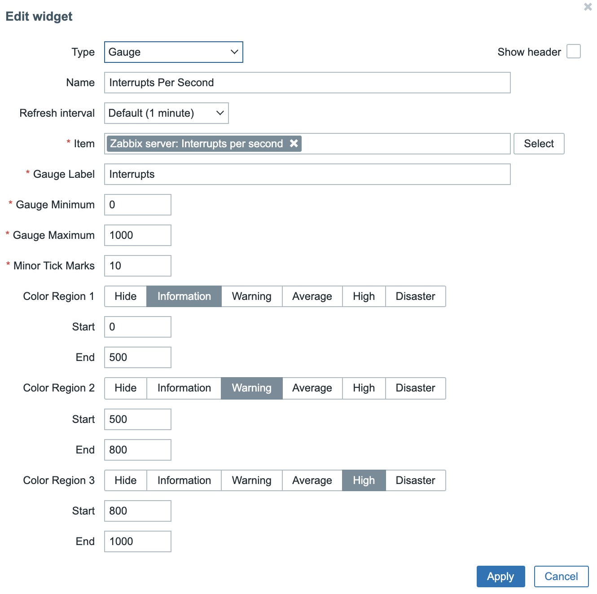

# Zabbix-Dashboard-Gauge
Add a Gauge Widget to your Zabbix Dashboards.

## What's new
##### March 13, 2022
* Initial Public Beta Release

## About the Gauge

The design of the Zabbix Gauge Widget is stronly influenced by [Google Chart's 'Gauge'](https://developers.google.com/chart/interactive/docs/gallery/gauge). It tries to emulate the configurable features of the google release but it renders as svg using zabbix native function calls.

Configuration of the gauge supports naming the widget, labeling the gauge, selecting your item, the gauge range, displaying the number of 'minor ticks' between 'major ticks', and highlighting up to 3 regions of the gauge to indicate normal and problem value ranges.  The gauge also shows the value with units currently displayed.

## What's inside
The installer script and related patch add functionality to zabbix-web to display item values in a gauge-style widget. _gauge-installer_ is an interactive script, it will confirm your zabbix docroot, zabbix release, backup your docroot into a tar file, and attempt a dry-run of the install before asking you if you really really want to install it.  There is also an option to reverse the install in case you change your mind.  See the section "Working with Patches" for more info. 

## Prerequisites
* Zabbix 6.0.1
* Linux binaries: _patch, grep, tar, cut, date, bash_

## Install
1. Download _gauge-installer_ and the patch file for your Zabbix release
2. As root, ```./gauge-installer``` and complete a successful install
3. Browser-refresh you dashboard pages  

## Working with Patches
1. _Do not ever delete your .patch files or the installer_
2. _You must always reverse the patch before upgrading zabbix-web_

Working with patches is a bit different from rpms, and you definitely can break stuff badly if you're not careful.  _gauge-installer_ tries to keep you from doing some 'bad things' when applying or removing the patch.  It can't save you from a ```yum upgrade zabbix-web``` commited on top of the patched docroot. 

Here's a sample install
```
# ./gauge-installer -h
****************************************************************
* ZABBIX DASHBOARD GAUGE INSTALLER                             *
*                                                              *
* This script runs some pre-flight tests to determine if you   *
* can safely patch your zabbix ui to add the gauge widgets.    *
****************************************************************

# ./gauge-installer [-h] [-r] [-T]
   -h   This help
   -r   Reverse installed patch
   -T   Do not backup docroot (install only)
#
# # ./gauge-installer
******************************************************************
* ZABBIX DASHBOARD GAUGE INSTALLER                               *
*                                                                *
* This script runs some pre-flight tests to determine if you can *
* safely patch before updating zabbix-web with the gauge widget. *
******************************************************************

Verifying installed binaries ... OK

Zabbix Web Docroot [/usr/share/zabbix]: 
Verifying zabbix release ... 6.0.1
Looking for the patch ... OK
Backing up /usr/share/zabbix to /tmp/zabbix-web-6.0.1-1647143556.tar ... OK

The script will now test the patch to be installed.
Press [ENTER] to begin or CTRL-C to exit: 

Testing patch install
checking file app/controllers/CControllerWidgetGaugeView.php
checking file app/views/monitoring.widget.gauge.view.php
checking file include/classes/mvc/CRouter.php
checking file include/classes/widgets/CWidgetConfig.php
checking file include/classes/widgets/forms/CWidgetFormGauge.php
checking file include/classes/widgets/views/widget.gauge.form.view.php
checking file include/defines.inc.php
Patch test completed successfully.

Press [ENTER] to install the patch, CTRL-C to exit: 

Performing patch install
patching file app/controllers/CControllerWidgetGaugeView.php
patching file app/views/monitoring.widget.gauge.view.php
patching file include/classes/mvc/CRouter.php
patching file include/classes/widgets/CWidgetConfig.php
patching file include/classes/widgets/forms/CWidgetFormGauge.php
patching file include/classes/widgets/views/widget.gauge.form.view.php
patching file include/defines.inc.php
Patch install completed successfully.

Please refresh your browser before continuing.
#
```

## Configuring the widget
Open a dashboard and add a widget.  You should see 'Gauge' as a new selection.  Edit widget requires an Item, Label, Min and Max, and Minor Tick Marks.  If you dont want minor tick marks enter 1.


## Bugs
There are quite a few.  Head over to [issues](../../issues/) to see them all.  Please report any new ones.
