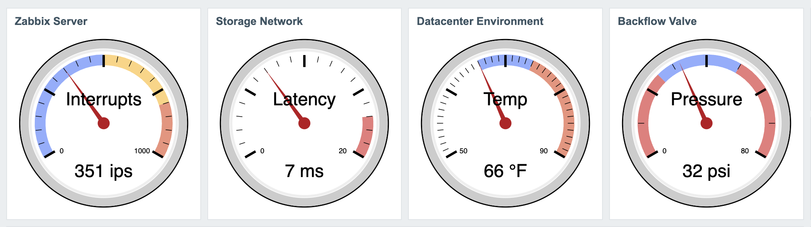

# Zabbix-Dashboard-Gauge
Add a Gauge Widget to your Zabbix Dashboards.

## What's new
##### March 14, 2022
* ENHANCEMENT: Patch now available for Zabbix 5.4.11
* ENHANCEMENT: Now with dark mode!
* ENHANCEMENT: Changed padding value, gauge is a little larger
* FIX: Performance issue with API query resolved

##### March 13, 2022
* Initial Public Beta Release

## About the Gauge

The design of the Zabbix Gauge Widget is strongly influenced by [Google Chart's 'Gauge'](https://developers.google.com/chart/interactive/docs/gallery/gauge). It tries to emulate most of the configurable features of the google release but it renders as svg without javascript while using zabbix native function calls. Because it's a native widget, it can be resized or moved around just like any other on your dashboard.

Configuration of the gauge supports naming the widget, labeling the gauge, selecting your item, the gauge range, displaying the number of 'minor ticks' between 'major ticks', and highlighting up to 3 regions of the gauge to indicate normal and problem value ranges.  The gauge also displays the value with units.

## What's inside
The installer script and related patches add functionality to zabbix-web to display item values in a gauge-style widget. _gauge-installer_ is an interactive script, it will confirm your zabbix docroot, zabbix release, backup your docroot into a tar file, and attempt a dry-run of the install before asking you if you are sure you really really want to install it.  There is also an option to reverse the install in case you change your mind.  See the section "Working with Patches" for more info. 

## Prerequisites
* Zabbix 5.4.11 or 6.0.1
* Linux binaries: _patch, grep, tar, cut, date, bash, git_

## Install
1. ```cd /root ; git clone https://github.com/jack-valko/Zabbix-Dashboard-Gauge.git```
2. ```cd Zabbix-Dashboard-Gauge ; ./gauge-installer```
3. Browser-refresh your dashboard pages  

## Working with Patches
1. _Do not ever delete your .patch files or the installer_
2. _If you need to upgrade your patch first uninstall the old one, download the new one, then apply the new patch_ 
3. _You must always reverse the patch before upgrading zabbix-web_

Working with patches is a bit different from rpms, and you definitely can break stuff badly if you're not careful.  _gauge-installer_ tries to keep you from doing some 'bad things' when applying or removing the patch.  It can't save you from a ```yum upgrade zabbix-web``` commited on top of the patched docroot. 

Here's a sample install:
```
# ./gauge-installer -h
******************************************************************
* ZABBIX DASHBOARD GAUGE INSTALLER                               *
*                                                                *
* This script runs some pre-flight tests to determine if you can *
* safely patch before updating zabbix-web with the gauge widget. *
******************************************************************

# ./gauge-installer [-h] [-r] [-T]
   -h   This help
   -r   Reverse installed patch
   -T   Do not backup docroot (install only)
#
# ./gauge-installer 
******************************************************************
* ZABBIX DASHBOARD GAUGE INSTALLER                               *
*                                                                *
* This script runs some pre-flight tests to determine if you can *
* safely patch before updating zabbix-web with the gauge widget. *
******************************************************************

Verifying installed binaries ... OK

Zabbix Web Docroot [/usr/share/zabbix]: 
Verifying zabbix release ... 5.4.11
Looking for the patch ... OK
Backing up /usr/share/zabbix to /tmp/zabbix-web-5.4.11-1647204178.tar ... OK

The script will now test the patch to be installed.
Press [ENTER] to begin or CTRL-C to exit: 

Testing patch install
checking file app/controllers/CControllerWidgetGaugeView.php
checking file app/views/monitoring.widget.gauge.view.php
checking file assets/styles/blue-theme.css
checking file assets/styles/dark-theme.css
checking file include/classes/mvc/CRouter.php
checking file include/classes/widgets/CWidgetConfig.php
checking file include/classes/widgets/forms/CWidgetFormGauge.php
checking file include/classes/widgets/views/widget.gauge.form.view.php
checking file include/defines.inc.php
Patch test completed successfully.

Press [ENTER] to install the patch, CTRL-C to exit: 

Performing patch install
patching file app/controllers/CControllerWidgetGaugeView.php
patching file app/views/monitoring.widget.gauge.view.php
patching file assets/styles/blue-theme.css
patching file assets/styles/dark-theme.css
patching file include/classes/mvc/CRouter.php
patching file include/classes/widgets/CWidgetConfig.php
patching file include/classes/widgets/forms/CWidgetFormGauge.php
patching file include/classes/widgets/views/widget.gauge.form.view.php
patching file include/defines.inc.php
Patch install completed successfully.

Please refresh your browser before continuing.

# ./gauge-installer -r
******************************************************************
* ZABBIX DASHBOARD GAUGE INSTALLER                               *
*                                                                *
* This script runs some pre-flight tests to determine if you can *
* safely patch before updating zabbix-web with the gauge widget. *
******************************************************************

Verifying installed binaries ... OK

Zabbix Web Docroot [/usr/share/zabbix]: 
Verifying zabbix release ... 6.0.1
Looking for the patch ... OK

The script will now test the patch to be uninstalled.
Press [ENTER] to begin or CTRL-C to exit: 

Testing patch uninstall
checking file app/controllers/CControllerWidgetGaugeView.php
checking file app/views/monitoring.widget.gauge.view.php
checking file assets/styles/blue-theme.css
checking file assets/styles/dark-theme.css
checking file include/classes/mvc/CRouter.php
checking file include/classes/widgets/CWidgetConfig.php
checking file include/classes/widgets/forms/CWidgetFormGauge.php
checking file include/classes/widgets/views/widget.gauge.form.view.php
checking file include/defines.inc.php
Patch test completed successfully.

Press [ENTER] to uninstall the patch, CTRL-C to exit: 

Performing patch uninstall
patching file app/controllers/CControllerWidgetGaugeView.php
patching file app/views/monitoring.widget.gauge.view.php
patching file assets/styles/blue-theme.css
patching file assets/styles/dark-theme.css
patching file include/classes/mvc/CRouter.php
patching file include/classes/widgets/CWidgetConfig.php
patching file include/classes/widgets/forms/CWidgetFormGauge.php
patching file include/classes/widgets/views/widget.gauge.form.view.php
patching file include/defines.inc.php
Patch uninstall completed successfully.

Please refresh your browser before continuing.
```

## Configuring the widget
Open a dashboard and click 'Edit Dashboard' in the upper right. Click '+ Add' to add a widget.  You should see 'Gauge' as a new selection in the add widget dropdown.  Each widget requires an Item, Gauge Label, Gauge Minimum and Maximum, and Minor Tick Marks.  Only numeric item types are supported. If you dont want minor tick marks, enter 1.

If you configure highlighted regions they will overlap and there is no collision detection.  Each region is applied in layers, from first to third.


## Bugs
There are quite a few.  Head over to [issues](../../issues/) to see them all.  Please report any new ones.
